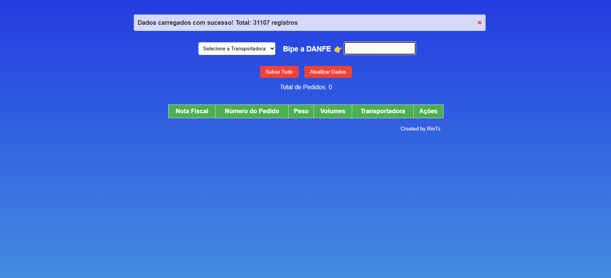
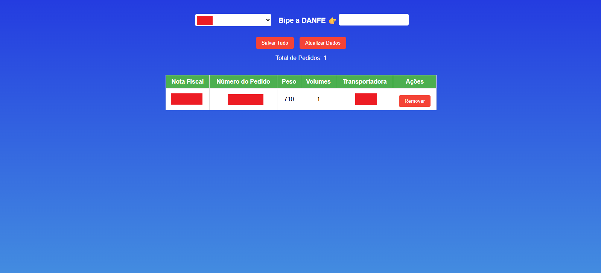

# Sistema de Auditoria de Outbound (Expedição) 🚚

   

## 📄 Sobre o Projeto

O **Sistema de Auditoria de Outbound** é uma ferramenta desenvolvida em Google Apps Script para agilizar e garantir a precisão no processo de expedição de mercadorias. A aplicação, que roda diretamente dentro de uma Planilha Google, permite que operadores de logística auditem os pacotes antes do envio, verificando se cada nota fiscal está sendo destinada ao grupo correto de transportadoras.

O grande diferencial do projeto é a **performance**. Todos os dados de expedição são pré-carregados na interface do usuário, permitindo que a validação de cada "bip" de DANFE seja instantânea, sem a necessidade de consultar a planilha a cada leitura, tornando o processo extremamente rápido e eficiente.

## ✨ Principais Funcionalidades

* **Interface Integrada à Planilha:** A ferramenta é aberta como um *modal* sobre a Planilha Google, facilitando o acesso e a utilização sem sair do ambiente de trabalho.
* **Auditoria por Grupo de Transportadora:** O operador seleciona um grupo de transportadoras (ex: "Correios", "GFL", "Azul") e o sistema valida se os pacotes bipados pertencem àquele grupo.
* **Validação Instantânea:** Graças ao pré-carregamento dos dados, cada DANFE lido é validado em tempo real. Erros, como uma nota fiscal destinada a uma transportadora incorreta ou não encontrada na base, são imediatamente sinalizados em vermelho na tela.
* **Leitura de DANFE:** O sistema está preparado para extrair o número da Nota Fiscal diretamente do código de barras de 44 dígitos do DANFE.
* **Otimização de Performance:** Para evitar lentidão, a aplicação carrega todos os dados da planilha para a memória do navegador no início, garantindo que as consultas durante a bipagem sejam instantâneas.
* **Registro e Verificação Posterior:** Todos os volumes auditados são salvos em uma aba "LANÇA". Uma função de verificação pode então colorir as linhas com base em uma conferência final, destacando acertos (verde) e erros (vermelho).
* **Atualização de Dados Dinâmica:** Permite que o operador atualize a base de dados em segundo plano sem perder os itens que já foram bipados na sessão atual.

## 💻 Tecnologias Utilizadas

* **Frontend:** HTML5, CSS3, JavaScript (Vanilla JS)
* **Backend & Automação:** Google Apps Script
* **Banco de Dados:** Google Sheets

## 🚀 Como Configurar e Usar

1.  **Crie a Planilha Google:**
    * Crie uma nova Planilha Google que será o centro da sua operação.
    * Crie as seguintes abas (páginas):
        * `DADOS`: Onde ficará a base de dados mestra. As colunas necessárias são: `Nota Fiscal`, `Número Pedido`, `Peso`, `Qtd volumes`, `Transportadoras`, `GRUPO DA TRANSPORTADORA`, `Valor`.
        * `LANÇA`: Onde os dados de cada sessão de auditoria serão salvos.
        * `VERIFICACAO`: Uma aba auxiliar para o processo de conferência final, com uma coluna indicando "CERTO" ou "ERRADO".

2.  **Configure o Google Apps Script:**
    * Na sua planilha, vá em `Extensões > Apps Script`.
    * No editor, cole todo o código do backend (as funções `doGet`, `abrirAuditoria`, `salvarNaLancaTodos`, etc.) no arquivo `Code.gs`.
    * Crie um novo arquivo HTML (`Arquivo > Novo > Arquivo HTML`) e nomeie-o como `index.html`.
    * Cole todo o código do frontend (HTML, CSS, JavaScript) neste novo arquivo.
    * Salve o projeto.

3.  **Crie um Menu para Acessar a Ferramenta:**
    * Para facilitar o uso, você pode criar um menu personalizado na sua planilha. Adicione o seguinte código ao seu arquivo `Code.gs`:

    ```javascript
    function onOpen() {
      SpreadsheetApp.getUi()
        .createMenu('Auditoria')
        .addItem('Abrir Auditoria de Outbound', 'abrirAuditoria')
        .addToUi();
    }
    ```

    * Salve o código. Agora, ao recarregar a planilha, um menu chamado "Auditoria" aparecerá, permitindo que qualquer usuário com acesso abra a ferramenta facilmente.

4.  **Execute a Aplicação:**
    * Recarregue a sua planilha.
    * Clique no novo menu `Auditoria > Abrir Auditoria de Outbound`.
    * Na primeira vez, você precisará autorizar as permissões que o script necessita para ler e escrever na sua planilha.

## 🖼️ Telas do Sistema

*(Sugestão: Adicione aqui screenshots da sua aplicação para deixar o repositório mais visual e fácil de entender)*

**Interface Principal de Auditoria:**


**Exemplo de Informações na Tela:**


## 👨‍💻 Autor

Feito por Ramon Madeira

[](https://www.linkedin.com/in/ramonmadeiratomaz/)
[](https://github.com/ramonmtomaz)
